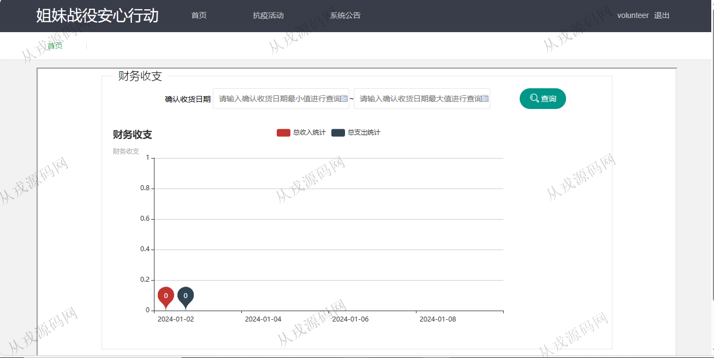
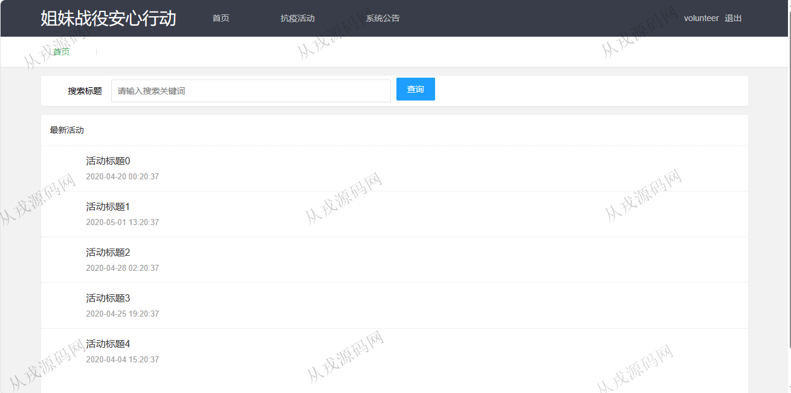
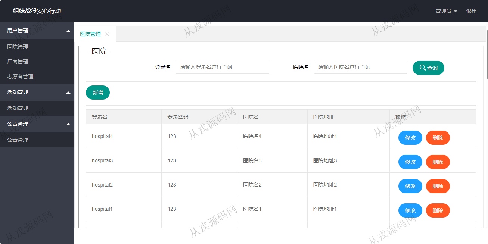
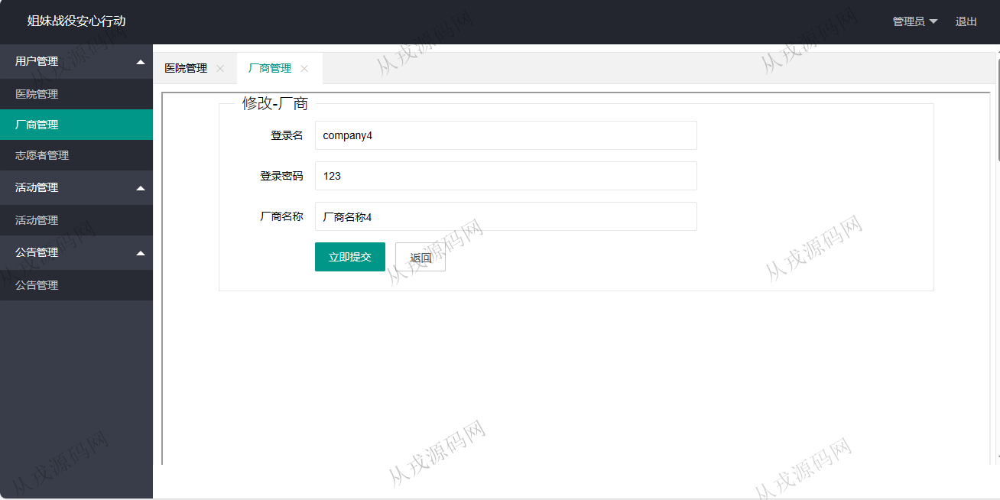
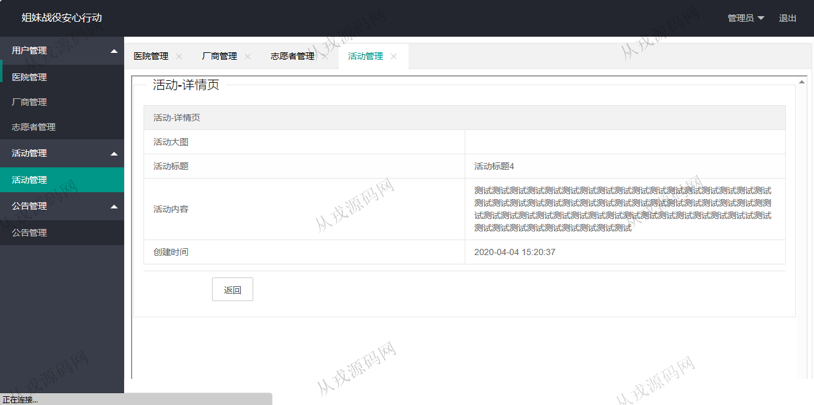
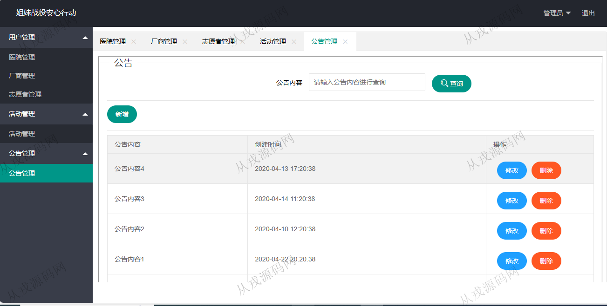

<h1 align="center">133.疫情防控管理系统</h1>

- <b>完整代码获取地址：从戎源码网 ([https://armycodes.com/](https://armycodes.com/))</b>
- <b>技术探讨、资料分享，请加QQ群：692619798</b> 
- <b>作者微信：19941326836  QQ：952045282</b> 
- <b>承接计算机毕业设计、Java毕业设计、Python毕业设计、深度学习、机器学习</b>
- <b>选题+开题报告+任务书+程序定制+安装调试+论文+答辩ppt 一条龙服务</b>
- <b>所有选题地址 ([https://github.com/YuLin-Coder/AllProjectCatalog](https://github.com/YuLin-Coder/AllProjectCatalog)) </b>

## 项目介绍
基于ssm的疫情防控管理系统：前端 jsp、jquery、layui，后端 springmvc、spring、mybatis；角色分为管理员、志愿者；集成医院管理、厂商管理、志愿者管理、抗疫活动等功能于一体的系统。

## 功能介绍

- 医院管理：医院信息的增删改查，多条件搜索查询
- 厂商管理：厂商信息的增删改查，按厂商名称模糊查询
- 志愿者管理：志愿者信息增删改查，按登录名和志愿者姓名模糊查询
- 活动管理：活动信息的增删改查，按活动标题模糊查询
- 公告管理：公告信息的增删改查，会在用户前台进行公告信息的展示
- 财务收支：财务收支情况的统计，柱状图展示，查询区间确认收货日期范围
- 抗疫活动：用户前台展示活动信息，标题模糊搜索

## 环境

- <b>IntelliJ IDEA 2021.3</b>

- <b>Mysql 5.7.26</b>

- <b>Tomcat 7.0.73</b>

- <b>JDK 1.8</b>

## 运行截图

